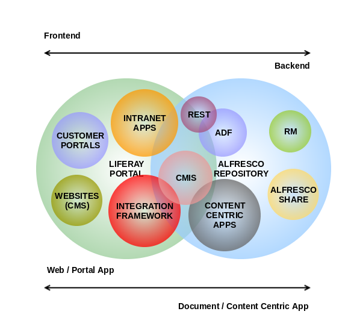

# Alfresco Devcon 2019

The materials for the lighting talk presentation at Alfresco Devcon 2019 are linked here:

## Portal & Content Services Revisited: Alfresco - Liferay Integration

In many real life scenarios, Digital Experience Platforms such as Liferay DXP (some time ago known as Enterprise Portals), and Content Services Platforms as Alfresco live together managing some parts of the document lifecycle. This portlet integration provides a solution for Alfresco content publication in a portal such as Liferay DXP via CMIS API.

The typical uses cases involve:

 * The publication of documents stored under a defined Alfresco rootPath or Smart Folder (for example, a publication folder in Alfresco Site).
   * without giving access to all portal users in Alfresco site.
   * even for a set of users that may be not Alfresco users.
   * where many times the content is public.
 * The possibility for browsing, searching and downloading contents from the portal page.
 * A solution for several logical views of the repository in different pages of the portal.

The main functionality of the portlet is to browse, search and download documents under a given rootPath of the Alfresco Repository. The endpoint and rootPath are configurable per portlet instance via an Alfresco consumer user under the given rootPath. Note, that you can deploy this portlet in multiple pages of your portal pointing to different rootPaths of your repository. Finally, you may consider an Alfresco Smart Folder also as rootPath, for a more complex case when the publication workflow is not focused under a usual Space Folder.

## Screenshots

### Browse features

### Search features

### Configuration

## About the author

Mikel Asla is IT/Solution developer at zylk.net, working with Alfresco-based solutions during the last 10 years in large organisations. He is board member of the Order of the Bee, an active user in Alfresco Community, an Alfresco addons developer, and docker local community leader.

 - Linkedin Profile - https://www.linkedin.com/in/mikelasla
 - Company Website  - http://www.zylk.net/es/home
 - Alfresco Blog    - http://www.zylk.net/alfresco-blog

## Tested on

This portlet integration is valid for:
 * Liferay 7.x DXP
 * Alfresco 5.x

## Contributors

 * Mikel Asla
 * Jon Ander Gonzalez
 * Cesar Capillas
 * Alfredo Sanchez

